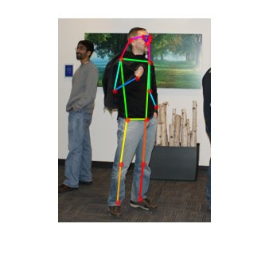

# Human Pose Estimation with Deep Learning


This demo shows how to train and test a human pose estimation using deep neural network. In R2019b, Deep Learning Toolbox(TM) supports low-level APIs to customize training loops and it enables us to train flexible deep neural networks. GPU Coder(TM) also enables us to deploy the trained model to an NVIDIA(R) Jetson(TM) devices. Once deployed, the human pose estimator will be running as a standalone.


This repository includes a pretrained network using the COCO dataset, which was collected by the COCO Consortium (cocodataset.org).


[](https://www.mathworks.com/matlabcentral/fileexchange/76860-human-pose-estimation-with-deep-learning)


# Required Toolboxes


Pose Estimation Toolbox requires the following products:


   -  MATLAB(R) R2019b or later (due to the R2019b new feature) 
   -  [Deep Learning Toolbox(TM)](https://mathworks.com/products/deep-learning.html) 
   -  [Image Processing Toolbox(TM)](https://mathworks.com/products/image.html) 
   -  [Computer Vision Toolbox(TM)](https://www.mathworks.com/products/computer-vision.html) 
   -  [Parallel Computing Toolbox(TM)](https://mathworks.com/products/parallel-computing.html) (Required for using GPU computation) 


To deploy the model to a NVIDIA Jetson or Drive platforms, you'll also need the following products.


   -  [MATLAB Coder(TM)](https://mathworks.com/products/matlab-coder.html) 
   -  [GPU Cder(TM)](https://mathworks.com/products/gpu-coder.html) 
   -  [GPU Coder Interface for Deep Learning Libraries support package](https://www.mathworks.com/matlabcentral/fileexchange/68642-gpu-coder-interface-for-deep-learning-libraries) (Addon package for GPU Coder) 
   -  [GPU Coder Support Package for NVIDIA GPUs](https://mathworks.com/help/supportpkg/nvidia/index.html) (Addon package for GPU Coder) 

# Installation


Download the [latest release](https://github.com/matlab-deep-learning/human-pose-estimation-with-deep-learning/releases/) of this repository. To install, open the .mltbx file in MATLAB.


# Getting Started


Open the project file to add paths to related folders if you cloned the GitHub respotory.


```matlab:Code(Display)
open simple-pose-estimation.prj
```


Load a pose estimator model.


```matlab:Code
detector = posenet.PoseEstimator;
```


First, read a test image, then crop a person and resize it to fit to the network input.


```matlab:Code
I = imread('visionteam1.jpg');
bbox = [182 74 303 404];
Iin = imresize(imcrop(I,bbox),detector.InputSize(1:2));
```


Then, perform the pose estimation on the image. To visualise the results we can superimpose the detected keypoints on the original image.


```matlab:Code
keypoints = detectPose(detector,Iin);
J = detector.visualizeKeyPoints(Iin,keypoints);
imshow(J);
```





[Click here](doc/GettingStarted.md) for a complete example.


# Examples

   -  [Estimate Human Pose For Multiple Person Using Pretrained Network](doc/SimplePoseNetForMultiPerson.md) 
   -  [Train Deep Neural Network for Human Pose Estimation](doc/SimplePoseNetTrainingExample.md) 
   -  [Human Pose Estimation With Webcam Images Using Deep Learning](doc/SimplePoseNetEstimationWithWebcamExample.md) 
   -  [Deploy Simple Pose Estimation on NVIDIA(R) Jetson(TM) Using GPU Coder(TM)](doc/SimplePoseNetEstimationOnJetson.md) 

# About the Model


The network architecture is based on Xiao's  pose estimation network[1] which combines upsampling and convolutional parameters into transposed convolutional layers in a much simpler way, without using skip layer connections. We also use COCO dataset[2] which is one of the well known large public human pose dataset.


[1] Xiao, Bin, Haiping Wu, and Yichen Wei. “Simple baselines for human pose estimation and tracking.” Proceedings of the European Conference on Computer Vision (ECCV). 2018.


[2] Lin, T., et al. "Microsoft COCO: Common objects in context. arXiv 2014." *arXiv preprint arXiv:1405.0312*.


*Copyright 2020 The MathWorks, Inc.*


