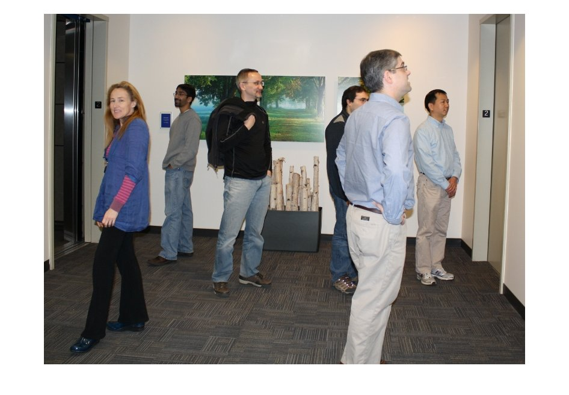

# Getting Started with Simple Pose Estimation
## Load pretrained pose estimator model

```matlab:Code
detector = posenet.PoseEstimator;
```

## Read an image


First, read a test image.


```matlab:Code
I = imread('visionteam1.jpg');
imshow(I);
```




## Crop a person and resize it to fit to the network input.

```matlab:Code
bbox = [182 74 303 404];
Iin = imresize(imcrop(I,bbox),detector.InputSize(1:2));
imshow(Iin);
```


## Detect pose and visulaze on the original image


To visualise the results we can superimpose the detected keypoints on the original image.


```matlab:Code
keypoints = detectPose(detector,Iin);
J = detector.visualizeKeyPoints(Iin,keypoints);
imshow(J);
```


*Copyright 2020 The MathWorks, Inc.*


