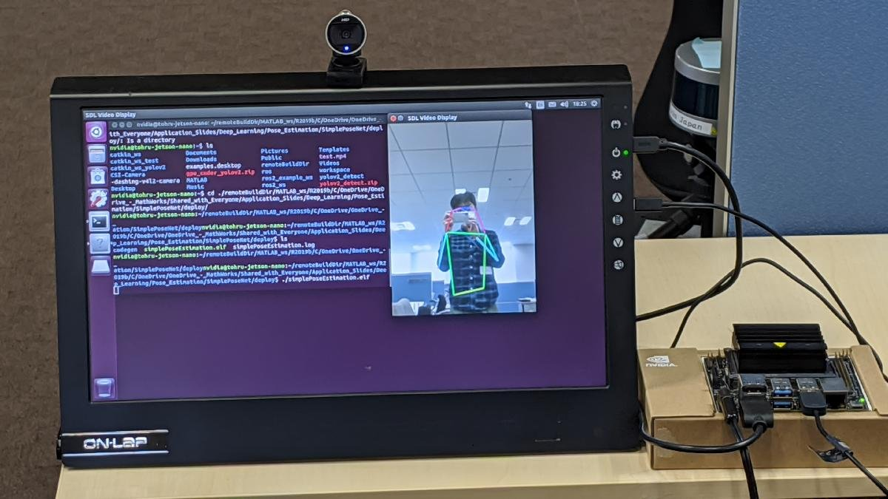
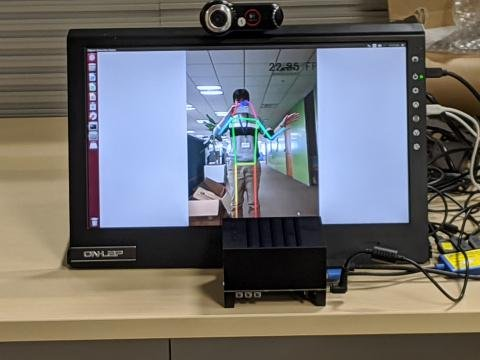
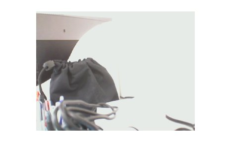

# Deploy Simple Pose Estimation on NVIDIA(R) Jetson(TM) Using GPU Coder(TM)





Running on a Jetson Nano.





Running on a Jetson AGX Xavier.


# **System Requirements**


[https://www.mathworks.com/help/supportpkg/nvidia/ug/install-and-setup-prerequisites.html](https://www.mathworks.com/help/supportpkg/nvidia/ug/install-and-setup-prerequisites.html)


# **Connect to the NVIDIA Hardware**

```matlab:Code
clear;
hwobj = jetson('tohru-jetson-nano', 'nvidia', 'nvidia');
```


```text:Output
Checking for CUDA availability on the Target...
Checking for 'nvcc' in the target system path...
Checking for cuDNN library availability on the Target...
Checking for TensorRT library availability on the Target...
Checking for prerequisite libraries is complete.
Gathering hardware details...
Checking for third-party library availability on the Target...
Gathering hardware details is complete.
 Board name         : NVIDIA Jetson TX1
 CUDA Version       : 10.0
 cuDNN Version      : 7.3
 TensorRT Version   : 5.0
 GStreamer Version  : 1.14.5
 V4L2 Version       : 1.14.2-1
 SDL Version        : 1.2
 Available Webcams  : MicrosoftÂ(R) LifeCam Cinema(TM)
 Available GPUs     : NVIDIA Tegra X1
```

# **Verify the GPU Environment**


Use the [coder.checkGpuInstall](matlab:doc('coder.checkGpuInstall')) function and verify that the compilers and libraries needed for running this example are set up correctly.


```matlab:Code
envCfg = coder.gpuEnvConfig('jetson');
envCfg.DeepLibTarget = 'cudnn';
envCfg.DeepCodegen = 1;
envCfg.HardwareObject = hwobj;
coder.checkGpuInstall(envCfg);
```


```text:Output
互換性のある GPU               : パス 
CUDA 環境                  : パス 
	ランタイム     : パス 
	cuFFT     : パス 
	cuSOLVER  : パス 
	cuBLAS    : パス 
cuDNN 環境                 : パス (警告: 深層学習コード生成は、cuDNN v7.5 を使用してテストされました。指定された cuDNN ライブラリの v7.3 に完全な互換性がない可能性があります。)
深層学習 (cuDNN) コードの生成      : パス 
```

# **Prepare Pose Estimation for Stand-Alone Deployment**


Include the webcam and display interfaces inside the Sobel edge detection application


```matlab:Code
w = webcam(hwobj);
img = snapshot(w);
d = imageDisplay(hwobj);
image(d,img);
```




# Test Pose Estimation Function on MATLAB

```matlab:Code
clear hwobj d w envCfg;
figure;
set(gcf,'Visible','on');
simplePoseEstimation
```


```text:Output
Checking for CUDA availability on the Target...
Checking for 'nvcc' in the target system path...
Checking for cuDNN library availability on the Target...
Checking for TensorRT library availability on the Target...
Checking for prerequisite libraries is complete.
Gathering hardware details...
Checking for third-party library availability on the Target...
Gathering hardware details is complete.
 Board name         : NVIDIA Jetson TX1
 CUDA Version       : 10.0
 cuDNN Version      : 7.3
 TensorRT Version   : 5.0
 GStreamer Version  : 1.14.5
 V4L2 Version       : 1.14.2-1
 SDL Version        : 1.2
 Available Webcams  : MicrosoftÂ(R) LifeCam Cinema(TM)
 Available GPUs     : NVIDIA Tegra X1
```


```matlab:Code
% Need to Ctrl+C to stop the running program.
```

# **Generate CUDA Code for the Target Using GPU Coder**

```matlab:Code
cfg = coder.gpuConfig('exe');
cfg.Hardware = coder.hardware('NVIDIA Jetson');
cfg.Hardware.BuildDir = '~/remoteBuildDir';
cfg.DeepLearningConfig = coder.DeepLearningConfig('cudnn');
cfg.GenerateExampleMain = 'GenerateCodeAndCompile';
codegen('-config ',cfg,'simplePoseEstimation.m','-report');
```


```text:Output
Warning: 無限ループのため、関数 'simplePoseEstimation' が終了しません。

警告 ==> simplePoseEstimation 行: 65 列: 1
コードの生成が成功しました (警告あり):レポートの表示
```

# Run the Pose Estimation on the Target


To run the generated executable on the target, use the MATLAB(R) runApplication function.


```matlab:Code
clear hwobj;
hwobj = jetson
```


```text:Output
Checking for CUDA availability on the Target...
Checking for 'nvcc' in the target system path...
Checking for cuDNN library availability on the Target...
Checking for TensorRT library availability on the Target...
Checking for prerequisite libraries is complete.
Gathering hardware details...
Checking for third-party library availability on the Target...
Gathering hardware details is complete.
 Board name         : NVIDIA Jetson TX1
 CUDA Version       : 10.0
 cuDNN Version      : 7.3
 TensorRT Version   : 5.0
 GStreamer Version  : 1.14.5
 V4L2 Version       : 1.14.2-1
 SDL Version        : 1.2
 Available Webcams  : MicrosoftÂ(R) LifeCam Cinema(TM)
 Available GPUs     : NVIDIA Tegra X1
hwobj = 
  jetson のプロパティ:

       DeviceAddress: 'tohru-jetson-nano'
                Port: 22
           BoardName: 'NVIDIA Jetson TX1'
         CUDAVersion: '10.0'
        cuDNNVersion: '7.3'
     TensorRTVersion: '5.0'
          SDLVersion: '1.2'
         V4L2Version: '1.14.2-1'
    GStreamerVersion: '1.14.5'
             GPUInfo: [1x1 struct]
          WebcamList: {'MicrosoftÂ(R) LifeCam Cinema(TM)'}

```


```matlab:Code
pid = runApplication(hwobj,'simplePoseEstimation');
```


```text:Output
### Launching the executable on the target...
Executable launched successfully with process ID 6938.
Displaying the simple runtime log for the executable...

Note: For the complete log, run the following command in the MATLAB command window:
system(hwobj,'cat /home/nvidia/remoteBuildDir/MATLAB_ws/R2020a/C/matlab/pose-estimation-github/work/simplePoseEstimation.log')
```


```matlab:Code
%killApplication(hwobj,'simplePoseEstimation');
```


*Copyright 2020 The MathWorks, Inc.*


