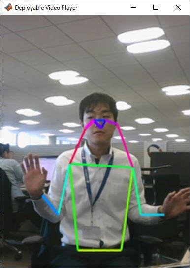

# Human Pose Estimation With Webcam Images Using Deep Learning


This example shows how to predict human poses using a pretrained mode with a web camera.





# Load Camera and Pretrained Network


Connect to the camera and load a pretrained GoogLeNet network. You can use any pretrained network at this step. The example requires MATLAB Support Package for USB Webcams, and Deep Learning Toolbox(TM) Model *for GoogLeNet Network*. If you do not have the required support packages installed, then the software provides a download link.


```matlab:Code
detector = posenet.PoseEstimator;
cam = webcam;
```

# **Continuously Estimate Human Pose**

```matlab:Code
player = vision.DeployableVideoPlayer;
I = zeros(256,192,3,'uint8');
player(I);

while player.isOpen
    
    % Read an image from web camera 
    I = snapshot(cam);
    
    % Crop the image fitting the network input size of 256x192 
    Iinresize = imresize(I,[256 nan]);
    Itmp = Iinresize(:,(size(Iinresize,2)-192)/2:(size(Iinresize,2)-192)/2+192-1,:);
    Icrop = Itmp(1:256,1:192,1:3);
    
    % Predict pose estimation
    heatmaps = detector.predict(Icrop);
    keypoints = detector.heatmaps2Keypoints(heatmaps);

    % Visualize key points
    Iout = detector.visualizeKeyPoints(Icrop,keypoints);
    player(Iout);
    
    if ~isOpen(player)
        break
    end
end
imshow(Iout);
clear cam
release(player)
```


*Copyright 2020 MathWorks, Inc.*


