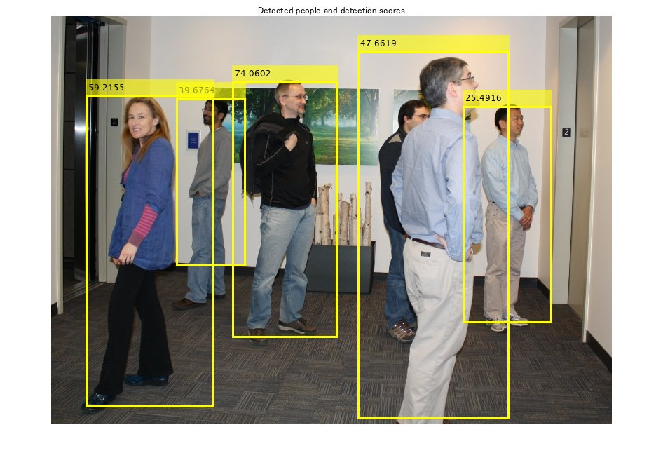
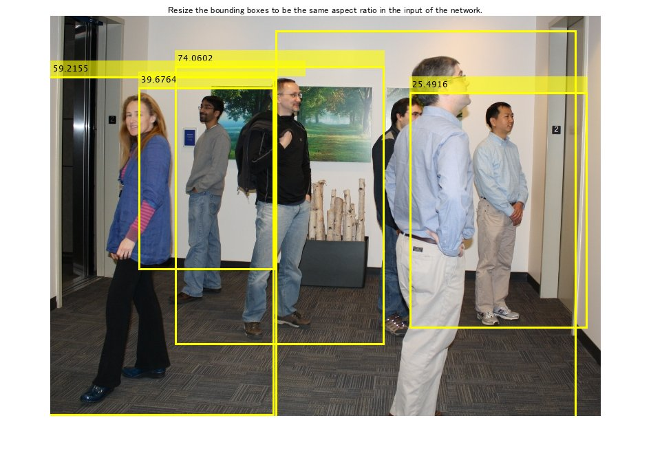
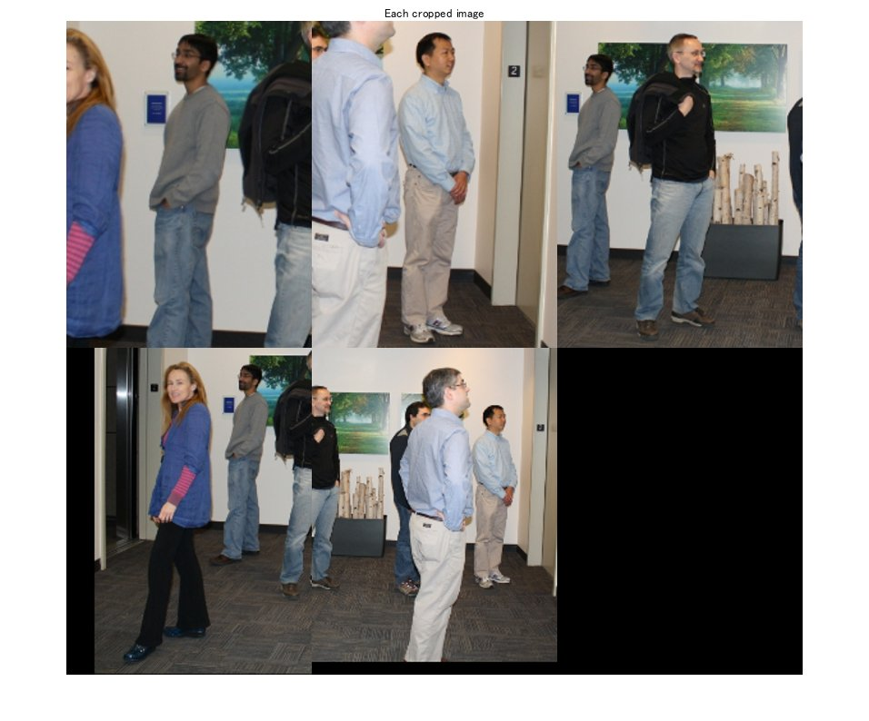
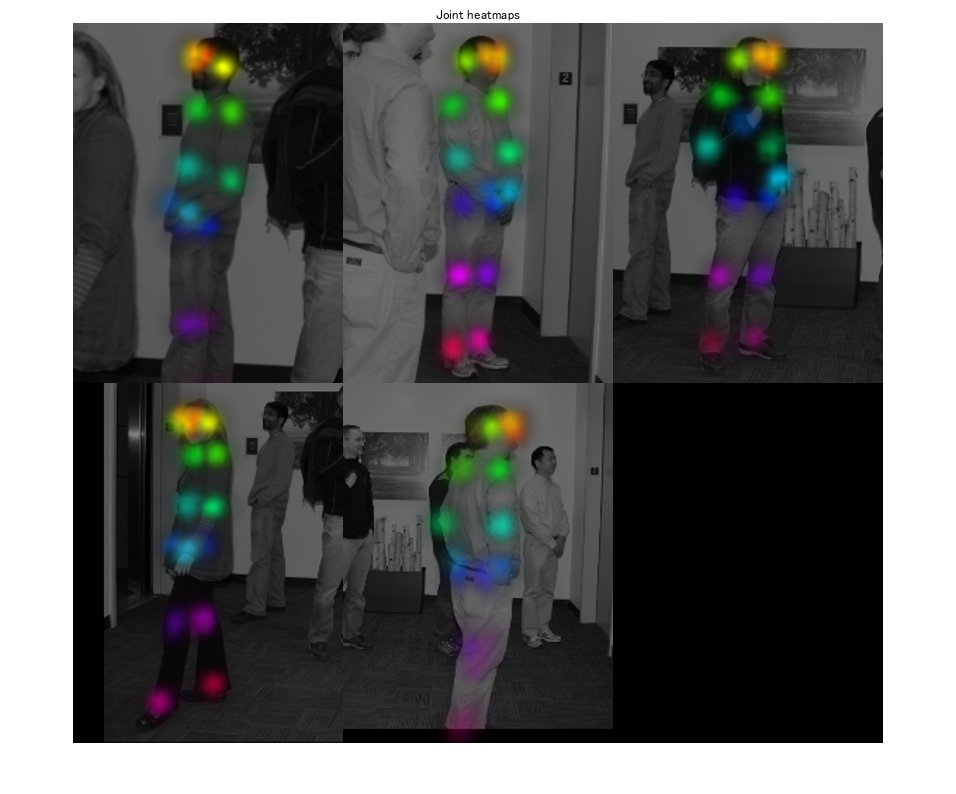
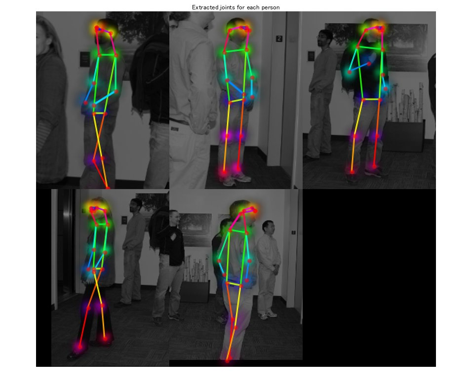
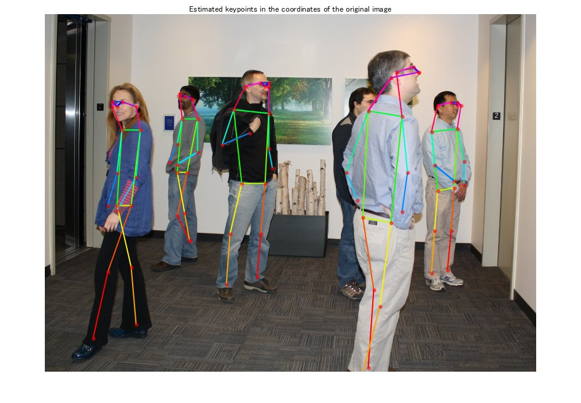

# Estimate Human Pose For Multiple Person Using Pretrained Network
# Load pretrained pose estimator model

```matlab:Code
detector = posenet.PoseEstimator;
```

# Make a prediction for multi-person


Next, we will try to estimate keypoints with a test image. First, read a test image.


```matlab:Code
I = imread('visionteam1.jpg');
imshow(I);
```


Detect people in the loaded image.


```matlab:Code
[bboxes,scores] = detectPeopleACF(I);
Iout = insertObjectAnnotation(I,'rectangle',bboxes,scores,'LineWidth',3);
imshow(Iout)
title('Detected people and detection scores')
```





Extract and transform the detected objects to fit the input of the network.


```matlab:Code
[croppedImages, croppedBBoxes] = detector.normalizeBBoxes(I, bboxes);
Iout2 = insertObjectAnnotation(I,'rectangle',croppedBBoxes,scores,'LineWidth',3);
imshow(Iout2);
title('Resize the bounding boxes to be the same aspect ratio in the input of the network.');
```





```matlab:Code
figure, montage(croppedImages);
title('Each cropped image')
```





Estimate keypoints for each cropped image


```matlab:Code
heatmaps = detector.predict(croppedImages);
Iheatmaps = detector.visualizeHeatmaps(heatmaps, croppedImages);
montage(Iheatmaps);
title("Joint heatmaps")
```





```matlab:Code
keypoints = detector.heatmaps2Keypoints(heatmaps);
Iheatmaps = detector.visualizeKeyPoints(Iheatmaps,keypoints);
montage(Iheatmaps);
title('Extracted joints for each person');
```





```matlab:Code
Iout3 = detector.visualizeKeyPointsMultiple(I,keypoints,croppedBBoxes);
imshow(Iout3);
title('Estimated keypoints in the coordinates of the original image');
```





*Copyright 2020 The MathWorks, Inc.*


