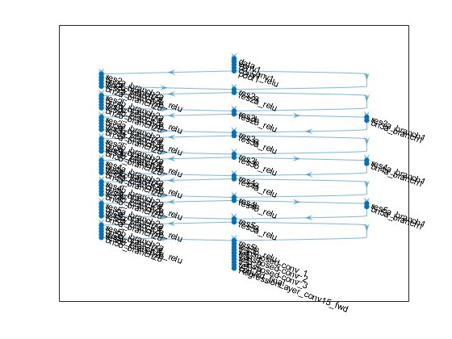

# Train Deep Neural Network for Human Pose Estimation


This example shows how to train a deep neural network for human pose estimation with a public dataset. The network architecture is based on Xiao's  pose estimation network[1] which combines upsampling and convolutional parameters into transposed convolutional layers in a much simpler way, without using skip layer connections. We also use COCO dataset[2] which is one of the well known large public human pose dataset.


### References


[1] Xiao, Bin, Haiping Wu, and Yichen Wei. “Simple baselines for human pose estimation and tracking.” Proceedings of the European Conference on Computer Vision (ECCV). 2018.


[2] Lin, T., et al. "Microsoft COCO: Common objects in context. arXiv 2014." *arXiv preprint arXiv:1405.0312*.


# Initialization

```matlab:Code
clear; close all; clc; rng('default');
showDatasetImages = false; % We don't publish the images from the dataset
```

# Set Dataset Paths


As a training dataset, we use COCO\hyperref{72EF1FDB}{[2]}. COCO's annotation data are formmated as JSON and include image filenames, pixel label data, categories, license information, and so on.  To decode and analyze JSON formatted files, you can use 'jsondecode' function. In this script, the validation data of COCO dataset is used as training data.


```matlab:Code
% COCO datset root directory.
cocoDir = 'D:\Dataset\coco';
if ~exist(cocoDir,"dir")
    error("Dataset cannot be found.")
end

% For train and validation images
imageTrainDir = fullfile(cocoDir,'train2017');
imageValDir = fullfile(cocoDir,'val2017');

% For annotation JSON file (.json)
jsonTrainFile = fullfile(cocoDir,'annotations','person_keypoints_train2017.json');
jsonValFile = fullfile(cocoDir,'annotations','person_keypoints_val2017.json');
```

# Load Person Keypoints Dataset

```matlab:Code
% Decode the JSON file
jsonTrain = jsondecode(fileread(jsonTrainFile));
jsonVal = jsondecode(fileread(jsonValFile));
```


Each image has one of 8 types of licenses for commercial, non-commercial use, unknown author, etc. In this section, we'll extract images having 3 types of it and save as new JSON formatted file. When it comes to license information, please refer to the following URLs.


   -  [https://creativecommons.org/licenses/by/3.0/deed.en](https://creativecommons.org/licenses/by/3.0/deed.en) 
   -  [https://creativecommons.org/licenses/by-sa/3.0/deed.en](https://creativecommons.org/licenses/by-sa/3.0/deed.en) 
   -  [https://creativecommons.org/licenses/by-nd/3.0/deed.en](https://creativecommons.org/licenses/by-nd/3.0/deed.en) 


```matlab:Code
% Get license ID
licTrain = [jsonTrain.images.license];
licVal = [jsonVal.images.license];

% Remove non-commercial use licensed images (Attribution License,Attribution-ShareAlike License,and Attribution-NoDerivs License)
jsonTrain.images = jsonTrain.images(licTrain==4 | licTrain==5 | licTrain==6);
jsonVal.images = jsonVal.images(licVal==4 | licVal==5 | licVal==6);
```


We also remove annotations and image paths that don't have enough key points respectively.


```matlab:Code
minJoints = 1;
nonzeroAnnTrain = [jsonTrain.annotations.num_keypoints] >= minJoints;
nonzeroAnnVal   = [jsonVal.annotations.num_keypoints] >= minJoints;
jsonTrain.annotations = jsonTrain.annotations(nonzeroAnnTrain);
jsonVal.annotations = jsonVal.annotations(nonzeroAnnVal);

% Remove annotations for the removed images too.
[validAnnTrain,imageIdIndTrain] = ismember([jsonTrain.annotations.image_id],[jsonTrain.images.id]);
[validAnnVal,imageIdIndVal] = ismember([jsonVal.annotations.image_id],[jsonVal.images.id]);

jsonTrain.annotations = jsonTrain.annotations(validAnnTrain);
jsonVal.annotations = jsonVal.annotations(validAnnVal);

imageIdIndTrain = imageIdIndTrain(validAnnTrain);
imageIdIndVal = imageIdIndVal(validAnnVal);
```


We don't use crowded flagged images.


```matlab:Code
% Exclude crowded images.
validAnnTrain = ~[jsonTrain.annotations.iscrowd];
validAnnVal = ~[jsonVal.annotations.iscrowd];
jsonTrain.annotations = jsonTrain.annotations(validAnnTrain);
jsonVal.annotations = jsonVal.annotations(validAnnVal);
imageIdIndTrain = imageIdIndTrain(validAnnTrain);
imageIdIndVal = imageIdIndVal(validAnnVal);
```


Extract image file names and ground truth joints, bounding boxes, and areas.


```matlab:Code
imagesTrain = string(imageTrainDir)+filesep+cat(1,jsonTrain.images(imageIdIndTrain).file_name);
imagesVal = string(imageValDir)+filesep+cat(1,jsonVal.images(imageIdIndVal).file_name);
gtruthJoints = permute(reshape([jsonTrain.annotations.keypoints],3,17,[]),[2 1 3]);
gtruthJointsVal = permute(reshape([jsonVal.annotations.keypoints],3,17,[]),[2 1 3]);
gtruthBboxes = [jsonTrain.annotations.bbox];
gtruthBboxesVal = [jsonVal.annotations.bbox];
gtruthAreas = [jsonTrain.annotations.area];
numJoints = size(gtruthJoints,1);

% Extract skelton connection map
skeleton = jsonTrain.categories.skeleton;
```


Define symmetric joint pairs for flipping in augmentation. Without swapping symmetrics pairs, the network will confuse to recognize left-right.


```matlab:Code
symmPairs = [2, 3
    4, 5
    6, 7
    8, 9
    10, 11
    12, 13
    14, 15
    16, 17];
```

# Visualize Dataset


Different scaled images are observed, so we need to normalize the sizes of the images.


```matlab:Code
if showDatasetImages
    figure; %#ok<UNRCH> 
    t = tiledlayout('flow');
    t.TileSpacing = 'compact';
    t.Padding = 'compact';
end
for k = 1:9
    I = imread(imagesTrain{k});
    joint = gtruthJoints(:,:,k);
    bbox = gtruthBboxes(:,k);
    Iout = visualizeKeyPoints(I,joint,skeleton,bbox); %#ok<NASGU> 
    if showDatasetImages
        nexttile %#ok<UNRCH> 
        imshow(Iout);
    end
end
```

# Create a Network with Transfer Learning approach


Note that the batch normalizations have a negative impact on the model training for some reason, so we remove them.


```matlab:Code
inputSize = [256 192 3];
originalNet = resnet18;
lgraph = layerGraph(originalNet);

lgraph = removeLayers(lgraph,'pool5');
lgraph = removeLayers(lgraph,'fc1000');
lgraph = removeLayers(lgraph,'prob');
lgraph = removeLayers(lgraph,'ClassificationLayer_predictions');
layers = [
    transposedConv2dLayer(4,256,"Name","transposed-conv_1","Cropping","same","Stride",[2 2],"BiasLearnRateFactor",0)
    %batchNormalizationLayer("Name","batchnorm_1")
    reluLayer("Name","relu_1")
    transposedConv2dLayer(4,256,"Name","transposed-conv_2","Cropping","same","Stride",[2 2],"BiasLearnRateFactor",0)
    %batchNormalizationLayer("Name","batchnorm_2")
    reluLayer("Name","relu_2")
    transposedConv2dLayer(4,256,"Name","transposed-conv_3","Cropping","same","Stride",[2 2],"BiasLearnRateFactor",0)
    %batchNormalizationLayer("Name","batchnorm_3")
    reluLayer("Name","relu_3")
    convolution2dLayer(1,numJoints,"Name","conv2d_final")
    ];
lgraph = addLayers(lgraph,layers);
lgraph = connectLayers(lgraph,'res5b_relu','transposed-conv_1/in');
```


Create a `dlnetwork` object from the layer graph.


```matlab:Code
dlnet = dlnetwork(lgraph)
```


```text:Output
dlnet = 
  dlnetwork のプロパティ:

         Layers: [74x1 nnet.cnn.layer.Layer]
    Connections: [81x2 table]
     Learnables: [88x3 table]
          State: [40x3 table]
     InputNames: {'data'}
    OutputNames: {'conv2d_final'}

```


Calculate the output size of the network.


```matlab:Code
output = predict(dlnet,dlarray(zeros([inputSize(1),inputSize(2),inputSize(3)]),'SSCB'));
outputSize = [size(output,1),size(output,2)];
downScaleFactor = inputSize(1) ./ outputSize(1);
```

# Augmentation


Crop images along with estimated bounding boxes and resize them into the fixed image input to the network.


```matlab:Code
numPreview = 3*4;
Iout = zeros([inputSize,numPreview],'uint8');
for k = 1:numPreview
    I = imread(imagesTrain{k});
    joint = gtruthJoints(:,:,k);
    bbox = gtruthBboxes(:,k);
    data = cell(3,1);
    data{1} = I;
    data{2} = joint;
    data{3} = bbox;
    augmentedData = augmentImageAndKeypoint(data,inputSize,symmPairs,true);
    Iout(:,:,:,k) = visualizeKeyPoints(augmentedData{1},augmentedData{2},skeleton,[]);
end
if showDatasetImages
    figure; %#ok<UNRCH> 
    montage(Iout);
end
```

# Generate Ground Truth Heatmaps


For each keypoint, we generate a gaussian kernel centered at the `(x, y)` coordinate, and use it as the training label. 


```matlab:Code
X = zeros([inputSize,numPreview],'single');
Y = zeros([outputSize,numJoints,numPreview],'single');
W = zeros([outputSize,numJoints,numPreview],'logical');
K = zeros(numJoints,3,numPreview,'single');
for k = 1:numPreview
    I = imread(imagesTrain{k});
    joint = gtruthJoints(:,:,k);
    data = cell(3,1);
    data{1} = I;
    data{2} = joint;
    data{3} = gtruthBboxes(:,k);
    augmentedData = augmentImageAndKeypoint(data,inputSize,symmPairs,true);
    X(:,:,:,k) = single(augmentedData{1});
    K(:,:,k) = single(augmentedData{2});
    [heatmaps,weights] = generateHeatmap(augmentedData{2},inputSize,outputSize);
    Y(:,:,:,k) = single(heatmaps);
    W(:,:,:,k) = repmat(permute(weights,[2 3 1]),outputSize(1:2));
end

% Visualzie
Ifused = visualizeHeatmaps(Y,X);
if showDatasetImages
    figure; %#ok<UNRCH> 
    montage(Ifused);
end
```

# Define Model Gradients Function


Create the function `modelGradients`, listed at the end of the example, that takes a `dlnetwork` object `dlnet`, a mini-batch of input data `dlX` with corresponding labels `Y` and returns the gradients of the loss with respect to the learnable parameters in `dlnet` and the corresponding loss.


# Specify Training Options


Specify the training options.


```matlab:Code
doTraining = false; % Set flase if you want to use a pretrained model
doRecording = true; % Set true if you want to record the prediction in the validation dataset

velocity = [];
numEpochs = 140;
miniBatchSize = 32;
numObservations = numel(imagesTrain);
numIterationsPerEpoch = floor(numObservations./miniBatchSize);
initialLearnRate = 0.001;
```


Train on a GPU if one is available. Using a GPU requires Parallel Computing Toolbox(TM) and a CUDA(R) enabled NVIDIA(R) GPU with compute capability 3.0 or higher.


```matlab:Code
executionEnvironment = "gpu";
```

# Train Model


Train the model using a custom training loop.


For each epoch, shuffle the data and loop over mini-batches of data. At the end of each epoch, display the training progress.


For each mini-batch:


   -  Convert the labels to dummy variables. 
   -  Convert the data to `dlarray` objects with underlying type single and specify the dimension labels `'SSCB'` (spatial, spatial, channel, batch). 
   -  For GPU training, convert to `gpuArray` objects. 
   -  Evaluate the model gradients and loss using `dlfeval` and the `modelGradients` function. 
   -  Determine the learning rate for the time-based decay learning rate schedule. 
   -  Update the network parameters using the `sgdmupdate` function. 


Initialize the training progress plot.


```matlab:Code
plots = "training-progress";
if plots == "training-progress" && doTraining
    figure
    lineLossTrain = animatedline;
    xlabel("Epochs")
    ylabel("Loss [dB]")
end

if doTraining
    % Stop button
    sz = get(0,'ScreenSize'); %#ok<UNRCH> 
    figure('MenuBar','none','Toolbar','none','Position',[20 sz(4)-100 240 70])
    uicontrol('Style', 'pushbutton', 'String', 'Stop',...
        'Position', [20 20 80 40],...
        'Callback', 'isTraining=false;');
    uicontrol('Style', 'pushbutton', 'String', 'Viz On/Off',...
        'Position', [120 20 80 40],...
        'Callback', 'isVisualizing=~isVisualizing;');
    % Visualize predictions during the training
    videoPlayer = vision.DeployableVideoPlayer;
    
    postfix = string(datetime('now','Format','yyyyMMdd_HHmmss'));
    
    if doRecording
        videoWriter = vision.VideoFileWriter("predictedHeatmaps"+postfix+".mp4",'FileFormat','MPEG4','FrameRate',10);
    end
end
```


Train the network.


```matlab:Code
threshold = 0.2;
isTraining = true;
isVisualizing = false;
iteration = 0;
rng('default');
start = tic;
X = zeros(inputSize(1),inputSize(2),inputSize(3),miniBatchSize,'single');
Y = zeros(outputSize(1),outputSize(2),numJoints,miniBatchSize,'single');
W = zeros(outputSize(1),outputSize(2),numJoints,miniBatchSize,'logical');
K = zeros(numJoints,3,4,'single');
averageGrad = [];
averageSqGrad = [];
loss_filt = 0;

if doTraining
    
    % Loop over epochs.
    for epoch = 1:numEpochs %#ok<UNRCH> 
        
        % Determine learning rate.
        if epoch >= 90
            learnRate = initialLearnRate/10;
        elseif epoch >= 120
            learnRate = initialLearnRate/100;
        else
            learnRate = initialLearnRate;
        end
        
        idxrnd = randperm(numObservations);
        
        % Loop over mini-batches.
        for i = 1:numIterationsPerEpoch
            iteration = iteration + 1;
            
            % Read mini-batch of data
            idx = (i-1)*miniBatchSize+1:i*miniBatchSize;
            for k = 1:miniBatchSize
                I = imread(imagesTrain{idxrnd(idx(k))});
                joint = single(gtruthJoints(:,:,idxrnd(idx(k))));
                bbox = single(gtruthBboxes(:,idxrnd(idx(k))));
                data = cell(3,1);
                data{1} = I;
                data{2} = joint;
                data{3} = bbox;
                augmentedData = augmentImageAndKeypoint(data,inputSize,symmPairs,true);
                X(:,:,:,k) = single(augmentedData{1});
                K(:,:,k) = single(augmentedData{2});
                [heatmaps,weights] = generateHeatmap(K(:,:,k),inputSize,outputSize);
                Y(:,:,:,k) = single(heatmaps);
                W(:,:,:,k) = repmat(permute(weights,[2 3 1]),outputSize(1:2));
            end
            
            % Convert mini-batch of data to dlarray.
            dlX = dlarray(X,'SSCB');
            dlY = dlarray(Y,'SSCB');
            dlW = dlarray(W,'SSCB');
            
            % If training on a GPU, then convert data to gpuArray.
            if (executionEnvironment == "auto" && canUseGPU) || executionEnvironment == "gpu"
                dlX = gpuArray(dlX);
                dlY = gpuArray(dlY);
                dlW = gpuArray(dlW);
            end
            
            % Evaluate the model gradients and loss using dlfeval and the
            % modelGradients function.
            [gradients,loss,dlYPred,state] = dlfeval(@modelGradients,dlnet,dlX,dlY,dlW);
            
            % Update the state of nonlearnable parameters.
            dlnet.State = state;
            
            % Update the network parameters using the ADAM optimizer.
            [dlnet.Learnables,averageGrad,averageSqGrad] = adamupdate(dlnet.Learnables,gradients,averageGrad,averageSqGrad,iteration,learnRate);
            
            % Display estimated keypoints from training data
            if isVisualizing
                YPred = extractdata(gather(dlYPred));
                Iout = visualizeHeatmaps(YPred, uint8(X));
                estimatedKeypoints = heatmaps2Keypoints(YPred, threshold, downScaleFactor);
                Iout = visualizeKeyPoints(Iout,estimatedKeypoints,skeleton,[]);
                Iout = imresize(imtile(Iout),1/2);
                videoPlayer(Iout);
            end
            
            % Display the training progress.
            if plots == "training-progress"
                D = duration(0,0,toc(start),'Format','hh:mm:ss');
                if loss_filt == 0
                    loss_filt = double(gather(extractdata(loss)));
                else
                    alpha = 0.5;
                    loss_filt = alpha*loss_filt + (1-alpha)*double(gather(extractdata(loss)));
                end
                addpoints(lineLossTrain,iteration/numIterationsPerEpoch,log10(loss_filt))
                lineLossTrain.Parent.Title.String = "Epoch: " + epoch + ...
                    ", Elapsed: " + string(D);
                drawnow;
            end
            
            drawnow;
            if ~isTraining
                break;
            end
        end
        if doRecording
            % Read mini-batch of validation data
            for k = 1:miniBatchSize
                I = imread(imagesVal{k});
                joint = single(gtruthJointsVal(:,:,k));
                bbox = single(gtruthBboxesVal(:,k));
                data = cell(3,1);
                data{1} = I;
                data{2} = joint;
                data{3} = bbox;
                augmentedData = augmentImageAndKeypoint(data,inputSize,symmPairs,false);
                X(:,:,:,k) = single(augmentedData{1});
            end
            
            % Convert mini-batch of data to dlarray.
            dlX = dlarray(X,'SSCB');
            
            % If training on a GPU, then convert data to gpuArray.
            if (executionEnvironment == "auto" && canUseGPU) || executionEnvironment == "gpu"
                dlX = gpuArray(dlX);
            end
            dlYPred = predict(dlnet,dlX);
            YPred = extractdata(gather(dlYPred));
            Iout = visualizeHeatmaps(YPred, uint8(X));
            estimatedKeypoints = heatmaps2Keypoints(YPred,threshold,downScaleFactor);
            Iout = visualizeKeyPoints(Iout,estimatedKeypoints,skeleton,[]);
            Iout = imresize(imtile(Iout),1/2);
            videoWriter(Iout);
        end
        if ~isTraining
            break;
        end
        
        if mod(epoch,20) == 0
            save("dlnet_"+postfix+"_epoch"+string(epoch),'dlnet');
        end
    end
    save("dlnet_"+postfix+"_final",'dlnet');
    if doRecording
        release(videoWriter);
    end
end
```

# Convert `dlnetwork` to `SeriesNetwork`

```matlab:Code
if ~doTraining
    modelFile = "simplePoseNet";
else
    simplePoseNet = layerGraph(dlnet);
    simplePoseNet = replaceLayer(simplePoseNet,'data',...
        imageInputLayer(inputSize,"Name","data","Normalization","zscore",...
        "Mean",simplePoseNet.Layers(1).Mean,...
        "StandardDeviation",simplePoseNet.Layers(1).StandardDeviation));
    simplePoseNet = addLayers(simplePoseNet,regressionLayer("Name","RegressionLayer_conv15_fwd"));
    simplePoseNet = connectLayers(simplePoseNet,'conv2d_final','RegressionLayer_conv15_fwd/in');
    simplePoseNet = assembleNetwork(simplePoseNet);
    SkeletonConnectionMap = skeleton;
    save("simplePoseNet_"+postfix+"_final",'simplePoseNet','SkeletonConnectionMap');
    modelFile = "simplePoseNet_"+postfix+"_final";
end
load(modelFile);
figure;
plot(simplePoseNet)
```




# Test Trained Model with Validation Images


TODO: implement evaluation functions like object keypoint similarity (OKS)


```matlab:Code
% Create input data and the corresponding ground truth
numImages = 8;
Igt = zeros([inputSize,numImages],'uint8');
Inorm = zeros([inputSize,numImages],'uint8');
for k = 1:numImages
    I = imread(imagesVal{k});
    joint = gtruthJointsVal(:,:,k);
    bbox = gtruthBboxesVal(:,k);
    data = cell(3,1);
    data{1} = I;
    data{2} = joint;
    data{3} = bbox;
    augmentedData = augmentImageAndKeypoint(data,inputSize,symmPairs,false);
    Inorm(:,:,:,k) = augmentedData{1};
    Igt(:,:,:,k) = visualizeKeyPoints(augmentedData{1},augmentedData{2},skeleton,[]);
end

if showDatasetImages
    figure, montage(Igt,"Size",[1 numImages]); %#ok<UNRCH> 
    title('Each cropped image')
end
```


Estimate keypoints for each cropped image


```matlab:Code
detector = posenet.PoseEstimator('MATFile',modelFile,...
    'NetworkName','simplePoseNet','SkeletonConnectionMap','SkeletonConnectionMap');
heatmaps = predict(detector,Inorm);
Iheatmaps = detector.visualizeHeatmaps(heatmaps, Inorm);
if showDatasetImages
    montage(Iheatmaps,"Size",[1 numImages]); %#ok<UNRCH> 
    title("Joint heatmaps")
end
```


Extract the miximum likely points.


```matlab:Code
keypoints = detector.heatmaps2Keypoints(heatmaps);
Ipred = detector.visualizeKeyPoints(Iheatmaps,keypoints);
if showDatasetImages
    montage(cat(4,Igt,Ipred),"Size",[2 numImages]); %#ok<UNRCH> 
    title('Joint extraction');
end
```

# Model Gradients Function


The `modelGradients` function takes a `dlnetwork` object `dlnet`, a mini-batch of input data `dlX` with corresponding labels `Y` and returns the gradients of the loss with respect to the learnable parameters in `dlnet` and the corresponding loss. To compute the gradients automatically, use the `dlgradient` function.


```matlab:Code
function [gradients,loss,dlYPredOut,state] = modelGradients(dlnet,dlX,dlY,dlW) %#ok<DEFNU> 
% Forward calculation
[dlYPredOut,state] = forward(dlnet,dlX);

% Weighted MSE
dlY = reshape(dlY(dlW),size(dlY,1),size(dlY,2),[]);
dlY = dlarray(dlY,'SSB');
dlYPred = reshape(dlYPredOut(dlW),size(dlYPredOut,1),size(dlYPredOut,2),[]);
dlYPred = dlarray(dlYPred,'SSB');
loss = mse(dlYPred,dlY);

% Backward calculation
gradients = dlgradient(loss,dlnet.Learnables);

end
```

# Supporting Functions

```matlab:Code
function data = augmentImageAndKeypoint(data,inputSize,symmPairs,isAugmented)
% Data augmentation
targetSize = [inputSize(2),inputSize(1)];
I = data{1};
if size(I,3) == 1
    I = repmat(I,[1 1 3]);
end
joint = data{2};
bbox = data{3};
if isAugmented
    zoomRange = 0.3;
    rotateRange = deg2rad(40);
    translateRange = 0;
    flip = true;
else
    zoomRange = 0;
    rotateRange = 0;
    translateRange = 0;
    flip = false;
end

% Extract valid joints to calculate a bounding box
jointValid = joint(joint(:,3)>0,1:2);

bboxMargin = 1.25;
if isempty(bbox)
    % Calculate bounding box if not provided
    jointsReshaped = jointValid;
    jointsTopLeft = min(jointsReshaped);
    jointsBottomRight = max(jointsReshaped);
    bboxSize = jointsBottomRight-jointsTopLeft;
    jointsBBoxes = [jointsTopLeft-bboxSize/2*(bboxMargin-1.0) bboxSize*bboxMargin];
else
    jointsTopLeft = bbox(1:2);
    bboxSize = bbox(3:4);
    jointsBBoxes = [jointsTopLeft-bboxSize/2*(bboxMargin-1.0) bboxSize*bboxMargin];
end
centerXShift = jointsBBoxes(1)+jointsBBoxes(3)/2;
centerYShift = jointsBBoxes(2)+jointsBBoxes(4)/2;
[moveToOriginTransform,moveBackTransform] = deal(eye(3));
moveToOriginTransform(3,1) = -centerXShift;
moveToOriginTransform(3,2) = -centerYShift;
moveBackTransform(3,1) = centerXShift;
moveBackTransform(3,2) = centerYShift;

zoomFactor = randn(1,1)*zoomRange+1;
zoomFactor = min(max(zoomFactor,1-zoomRange),1+zoomRange);
scaleTransform = [zoomFactor 0 0;
    0 zoomFactor 0;
    0 0 1];

rotationFactor = randn(1,1)*rotateRange;
rotationFactor = min(max(rotationFactor,-rotateRange*2),rotateRange*2);
if rand > 0.6
    rotationFactor = 0;
end
rotationTransform = [cos(rotationFactor) sin(rotationFactor) 0;
    -sin(rotationFactor) cos(rotationFactor) 0;
    0 0 1];
if flip && (rand > 0.5)
    x_scale = -1;
    % Swap pair joints
    ind = (1:size(joint,1))';
    ind(symmPairs(:,1)) = symmPairs(:,2);
    ind(symmPairs(:,2)) = symmPairs(:,1);
    joint = joint(ind,:);
else
    x_scale = 1;
end
reflectionTransform = [x_scale 0 0; 0 1 0; 0 0 1];

translationTransform = eye(3);
translationTransform(3,1) = randn*translateRange;
translationTransform(3,2) = randn*translateRange;

heightMajor = jointsBBoxes(4) > jointsBBoxes(3);
maxEdge = max(jointsBBoxes(4),jointsBBoxes(3));
scale = targetSize(heightMajor+1)/maxEdge;
scaledTransform = eye(3);
scaledTransform(1,1) = scale;
scaledTransform(2,2) = scale;

croppedBBoxes = [jointsBBoxes(1)-(targetSize(1)/scale-jointsBBoxes(3))/2,...
    jointsBBoxes(2)-(targetSize(2)/scale-jointsBBoxes(4))/2,...
    targetSize(1)/scale,...
    targetSize(2)/scale];
moveToTopLeftTransform = eye(3);
moveToTopLeftTransform(3,1) = -croppedBBoxes(1);
moveToTopLeftTransform(3,2) = -croppedBBoxes(2);

bboxCropTransform = moveToTopLeftTransform*scaledTransform;

centeredRotation = moveToOriginTransform * rotationTransform * moveBackTransform;
centeredScale = moveToOriginTransform * scaleTransform * moveBackTransform;
centeredReflection = moveToOriginTransform * reflectionTransform * moveBackTransform;

Tout = centeredReflection * centeredScale * centeredRotation * translationTransform * bboxCropTransform;
tform = affine2d(Tout);

imageAugmented = imwarp(I,tform,...
    'OutputView',imref2d([targetSize(2) targetSize(1)]),...
    'SmoothEdges',true,...
    'FillValues',127);

jointsTrans = tform.transformPointsForward(joint(:,1:2));
jointAugmented = [jointsTrans joint(:,3)];

data{1} = imageAugmented;
data{2} = jointAugmented;
end
```

## Heatmap generation:

```matlab:Code
function [heatmaps,weights] = generateHeatmap(joints_3d,inputSize,outputSize)
heatmapSize = [outputSize(2),outputSize(1)];
sigma = 2;
featStride = [inputSize(2),inputSize(1)]./heatmapSize;
numJoints = size(joints_3d,1);
heatmaps = zeros([heatmapSize(2) heatmapSize(1) numJoints]);
weights = joints_3d(:,3);
tmpSize = sigma * 3;
for k = 1:numJoints
    muX = round(joints_3d(k,1) / featStride(1));
    muY = round(joints_3d(k,2) / featStride(2));
    upperLeft = [floor(muX - tmpSize), floor(muY - tmpSize)];
    bottomRight = [floor(muX + tmpSize + 1), floor(muY + tmpSize + 1)];
    if (upperLeft(1) >= heatmapSize(1) || upperLeft(2) >= heatmapSize(2) || ...
            bottomRight(1) <  0 ||  bottomRight(2) < 0)
        weights(k) = 0;
        continue
    end
    sizeRegion = 2 * tmpSize + 1;
    [x,y] = meshgrid(1:sizeRegion,1:sizeRegion);
    x0 = floor(sizeRegion/2);
    y0 = x0;
    g = exp(-((x - x0).^2 + (y - y0).^2) ./ (2*(sigma^2)));
    
    g_x = [max(0, -upperLeft(1)), min(bottomRight(1),heatmapSize(1))-upperLeft(1)-1] + 1;
    g_y = [max(0, -upperLeft(2)), min(bottomRight(2),heatmapSize(2))-upperLeft(2)-1] + 1;
    img_x = [max(0, upperLeft(1)), min(bottomRight(1),heatmapSize(1))-1] + 1;
    img_y = [max(0, upperLeft(2)), min(bottomRight(2),heatmapSize(2))-1] + 1;
    if weights(k) > 0
        heatmaps(img_y(1):img_y(2), img_x(1):img_x(2),k) = g(g_y(1):g_y(2),g_x(1):g_x(2));
    end
end
end
```


**Heatmaps visualization:**


```matlab:Code
function Iout = visualizeHeatmaps(heatmaps, I)
I = im2single(uint8(I));
I = reshape(rgb2gray(reshape(permute(I,[1 2 4 3]),1,[],3)),size(I,1),size(I,2),1,[]);
% Create color mask
cmap = shiftdim(hsv(size(heatmaps,3))',-2);
mask = imresize(max(heatmaps,[],3),[size(I,1),size(I,2)]);
mask = max(mask,0);
mask = min(mask,1);
outputColored = squeeze(max(permute(heatmaps,[1,2,5,3,4]).* cmap,[],4));
% Overlay
outputColoredUpscaled = imresize(outputColored,[size(I,1),size(I,2)]);
Iout = (1-mask).*I*0.5 + mask.*outputColoredUpscaled;
Iout = im2uint8(Iout);
end
```


**Keypoints visualization:**


```matlab:Code
function Iout = visualizeKeyPoints(I,joints,skeleton,bboxes)
numEdges = size(skeleton,1);
cmapEdges = im2uint8(hsv(numEdges));

% Plot edges and nodes
Iout = I;
for k = 1:size(joints,3)
    pts = joints(:,:,k);
    pos = [pts(skeleton(:,1),:) pts(skeleton(:,2),:)];
    validIdxEdge = all(pos(:,[3 6])>0,2);
    
    pos = pos(validIdxEdge,[1,2,4,5]);
    cmaps_temp = cmapEdges(validIdxEdge,:);
    if size(Iout,4) > 1
        if ~isempty(bboxes)
            Iout(:,:,:,k) = insertShape(Iout(:,:,:,k),"Rectangle",bboxes(:,k)',"LineWidth",3);
        end
        Iout(:,:,:,k) = insertShape(Iout(:,:,:,k),"Line",pos,"LineWidth",3,"Color",cmaps_temp);
        validIdxNode = pts(:,3)>0;
        Iout(:,:,:,k) = insertShape(Iout(:,:,:,k),...
            "FilledCircle",[pts(validIdxNode,1:2) ones(sum(validIdxNode),1)*3],...
            "Color","Red");
    else
        if ~isempty(bboxes)
            Iout = insertShape(Iout,"Rectangle",bboxes(:,k)',"LineWidth",3);
        end
        Iout = insertShape(Iout,"Line",pos,"LineWidth",3,"Color",cmaps_temp);
        validIdxNode = pts(:,3)>0;
        Iout = insertShape(Iout,...
            "FilledCircle",[pts(validIdxNode,1:2) ones(sum(validIdxNode),1)*3],...
            "Color","Red");
    end
end
end
```

## Heatmaps to keypoints conversion:

```matlab:Code
function keypoints = heatmaps2Keypoints(heatmaps,threshold,downScaleFactor) %#ok<DEFNU> 
[confs,idx] = max(heatmaps,[],[1,2],'linear');
[y,x,~,~] = ind2sub(size(heatmaps),idx);
keypoints = permute(cat(1,x,y),[3,1,4,2]) * downScaleFactor;
keypoints = [keypoints,permute(confs>threshold,[3 1 4 2])];
end
```


*Copyright 2020 The MathWorks, Inc.*


